# **Wax Wisdom**
Wax Wisdom is a fictious candle making blog which posts blogs weekly on various fragrance combinations, tips etc as well as how to tutorials for its readers. The blog became so popular and received so many messages that the owner Lechner decided to host candle making workshops for her loyal customers. Since there is no payment gateway implemented the customers are expected to pay on the day, the wax studio accepts cash or card using a sumup card payment machine.

## **Table of Contents**

1. [Introduction](#introduction)
2. [Overview](#overview)
3. [UX - User Experience](#ux---user-experience)
    - [Design Inspiration](#design-inspiration)
    - [Colour Scheme](#colour-scheme)
    - [Font](#font)
4. [Project Planning](#project-planning)
    - [Strategy Plane](#strategy-plane)
    - [Site Goals](#site-goals)
    - [Agile Methodologies - Project Management](#agile-methodologies---project-management)
    - [MoSCoW Prioritization](#moscow-prioritization)
    - [Sprints](#sprints)
    - [User Stories](#user-stories)
5. [Scope Plane](#scope-plane)
6. [Structural Plane](#structural-plane)
7. [Skeleton & Surface Planes](#skeleton--surface-planes)
    - [Wireframes](#wireframes)
8. [Database Schema - Entity Relationship Diagram](#database-schema---entity-relationship-diagram)
9. [Security](#security)
10. [Features](#features)
    - [User View - Registered/Unregistered](#user-view---registeredunregistered)
    - [Candle workshop Booking System](#appointment-booking-system)
    - [Profile Management](#profile-management)
    - [Confirmation Messages](#confirmation-messages)
    - [CRUD Functionality](#crud-functionality)
11. [Future Features](#future-features)
12. [Technologies & Languages Used](#technologies--languages-used)
13. [Libraries & Frameworks](#libraries--frameworks)
14. [Tools & Programs](#tools--programs)
15. [Testing](#testing)
  - [Validation Testing](#validation-testing)
  - [User Testing](#user-testing)
  - [Bugs](#bugs)
16. [Deployment](#deployment)
    - [Connecting to GitHub](#connecting-to-github)
    - [Django Project Setup](#django-project-setup)
    - [Cloudinary API](#cloudinary-api)
    - [SQLite3](#SQLite3)
    - [Heroku deployment](#heroku-deployment)
    - [Clone project](#clone-project)
    - [Fork Project](#fork-project)
17. [Privacy Policy](#privacy-policy)
18. [Credits](#credits)
    - [Code](#code)
    - [Media](#media)
    - [Additional reading/tutorials/books/blogs](#additional-readingtutorialsbooksblogs)
19. [Acknowledgements](#acknowledgements)

## overview
Wax wisdom is an online blog website which offers customers weekly candle making workshop that allows users to:

register and create a profile
Book a candle workshop
leave a review
UX - User Experience
Design Inspiration
My inspiration for Wax wisdom came from my joy of making candles.

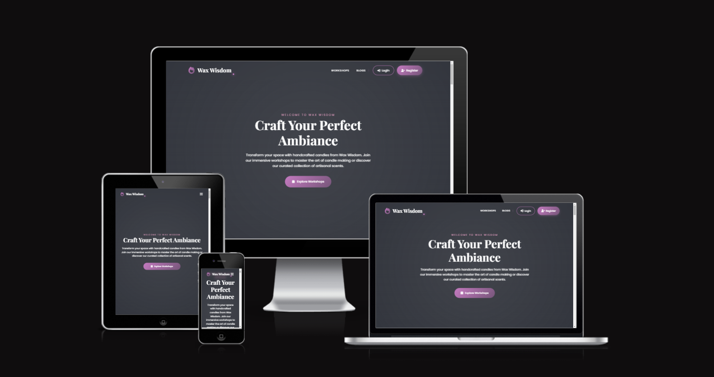

https://ui.dev/amiresponsive

## UX - User Experience

Colour Scheme
I chose pinks, purples and greys as I believe they are aesthetically pleasing and would be appealing to the target audience who are prodominantly women, but not limited to.


Primary Color: #2F323A (charcoal grey)
Secondary Color: #DEBAC0 (Pink)
Accent Color: #7757A (Purple)
Background: #fff (White) This combination ensures clarity, accessibility, and a professional appearance, allowing for easy navigation throughout the site.
### Font
for the font I have used **playfair** display
The rest of the body text and interactive elements will use **poppins** for its readability and clean look.
Project Planning

## Strategy Plane
### Design Inspiration
The primary objective of Wax Wisdom is to bring together an informative blog about candle creation and a candle making workshop. By offering an intuitive interface, users can book a candle workshop safely and seamlessly from a trusted company who believe in high quality.

site goals

1. Provide Candle-Related Information
Goal: Establish Wax Wisdom as a trusted source of information about candles and candle-making.
Features Supporting This Goal:
Blog section with engaging and informative posts about candles, DIY tips, and related topics.
Easy-to-navigate structure for users to browse blog posts.
2. Offer Workshop Booking
Goal: Enable users to easily book candle-making workshops to enhance their skills and learn about the art of candle-making.
Features Supporting This Goal:
Workshop listing with details (e.g., date, time, location, capacity).
Workshop booking system with availability and validation for user bookings.
Confirmation and notification system for bookings.
3. Build a Community of Candle Enthusiasts
Goal: Create an engaging platform for users who are passionate about candles and candle-making.
Features Supporting This Goal:
User authentication to allow interaction with the site (e.g., booking, leaving reviews).
Review system for users to share their feedback on workshops.
Potential for future community features, like user comments on blog posts or forums.
4. Enhance Brand Identity
Goal: Promote the Wax Wisdom brand as a leading candle-making workshop provider.
Features Supporting This Goal:
Consistent and aesthetically pleasing design aligned with the brand.
Content that highlights the expertise and unique selling points of Wax Wisdom workshops.
A "About" section to build trust and provide background about the company.
5. Ensure Usability and Accessibility
Goal: Deliver a user-friendly and accessible experience for all users, regardless of device or ability.
Features Supporting This Goal:
Responsive design that adapts to all screen sizes (mobile, tablet, desktop).
Adherence to Web Content Accessibility Guidelines (WCAG).
Clear navigation and intuitive user interface.
6. Drive Business Growth
Goal: Increase workshop attendance and grow Wax Wisdom’s customer base.
Features Supporting This Goal:
Easy-to-use booking process that minimizes user friction.
SEO-friendly blog content to drive organic traffic.
Integration of social sharing options to promote content and workshops.
7. Gather Feedback and Insights
Goal: Collect valuable feedback from users to improve the workshops and the overall user experience.
Features Supporting This Goal:
Reviews and ratings system for workshops.
Data collection on user behavior and popular blog topics (for potential analytics).

#### MoSCoW Prioritization
## Must Have 
User Authentication

Registration, login, and logout functionality.
Role-based access (admin vs. customer).
Password security using Django's built-in authentication.
Workshop Booking System

Form for users to book workshops.
Database to store booking information.
Booking validation (e.g., availability, duplicate bookings).
Blog Section

Create, read, update, delete (CRUD) functionality for blog posts (admin-only).
Blog post listings and detailed views for users.
SEO-friendly structure for blog posts.
Workshop Review System

Users can leave reviews for workshops.
Display reviews on the workshop detail pages.
Responsive Design

Fully functional on mobile, tablet, and desktop.
Accessible layout adhering to Web Content Accessibility Guidelines (WCAG).
Database and Models

Custom models for workshops, bookings, and reviews.
Properly managed migrations to reflect database structure.
Basic Deployment

Host the application on a cloud platform Heroku 
Secure deployment (environment variables, DEBUG mode off).
Should Have (Important but not critical for immediate delivery)
These features add significant value and should be included if time permits.

About Page

Informational page about the company and its mission.
Improved Notificatons
Confirmation emails for workshop bookings.
Feedback messages after booking or submitting a review.
Pagination and Filtering

Blog post pagination.
Filtering workshops by date, location, or availability.
Admin Dashboard Enhancements

Admin view to manage bookings and reviews.
Charts or stats to track booking trends.
Could Have (Desirable but not necessary)
These features can be deferred to later phases of the project.

## Wont Have
Search Functionality

Search bar for blog posts or workshops.
Wishlist for Workshops

Allow users to "save" workshops they are interested in.
Social Sharing

Buttons to share blog posts or workshops on social media.
Workshop Recommendations

Suggest workshops based on user preferences or past bookings.
User Profile Page

View past bookings and reviews submitted.

E-commerce Integration

Selling candles or workshop-related products online.
Advanced Analytics

User behavior tracking and advanced reporting tools.
Gamification

Reward systems or badges for workshop participation or reviews.
Live Chat or Chatbot

Customer support features like live chat.

Won’t Have (For Now) (Not in scope for the current project)
Won’t Have (For Now) (Not in scope for the current project)

## Sprints

- **sprint 1**  Project setup, GitHub configuration, Agile board setup, and initial database setup.
- **sprint 2** Create blog models and views, implement list and detail pages, and add styling.
- **sprint 3** Create workshop and booking models, forms, and views. Test booking functionality.
- **sprint 4** Implement user authentication (register, login, logout) and role-based access.
- **sprint 5** Create review model, forms, and views. Link reviews to workshops.
- **sprint 6** Complete front-end styling (home page, blog, booking, reviews).
- **sprint 7** Write tests for models, forms, and views. Perform manual testing.
- **sprint 8** Prepare deployment (static files, environment variables).
- **sprint 9** Deploy project to the cloud. Finalise README file with documentation.

## Sample User Stories

Blog
- As a user, I want to view a list of blog posts so that I can read about candle-related topics.
- As an admin, I want to create, edit, and delete blog posts so that I can manage content on the website.

Workshop Booking
- As a user, I want to view available workshops so that I can choose one to attend.
- As a user, I want to book a workshop so that I can learn candle-making.

Review System
- As a user, I want to leave a review after attending a workshop so that I can share my feedback.
- As an admin, I want to manage reviews so that I can ensure quality feedback on the website.

User Authentication
- As a user, I want to register and log in so that I can book workshops and leave reviews.
- As an admin, I want to manage users so that I can monitor bookings and reviews.

The Wax Wisdom platform will include the following MVP functionalities:

User registration 
blogs
Candle workshop scheduling for customers
reviews

Structural Plane
 Wax Wisdom candle blog, with a focus on user-friendly navigation, robust booking functionality, and a seamless experience for visitors and users. It also ensures that the blog is set up for efficient content management and growth.

## Skeleton & Surface Planes
Wireframes
Wireframes were created for the following key pages to ensure an intuitive user journey:

Home Page
mobile home page view

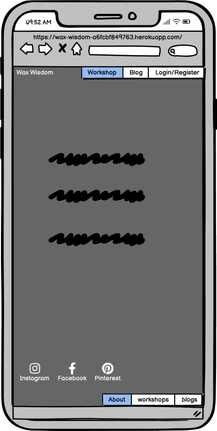

Tablet home page view

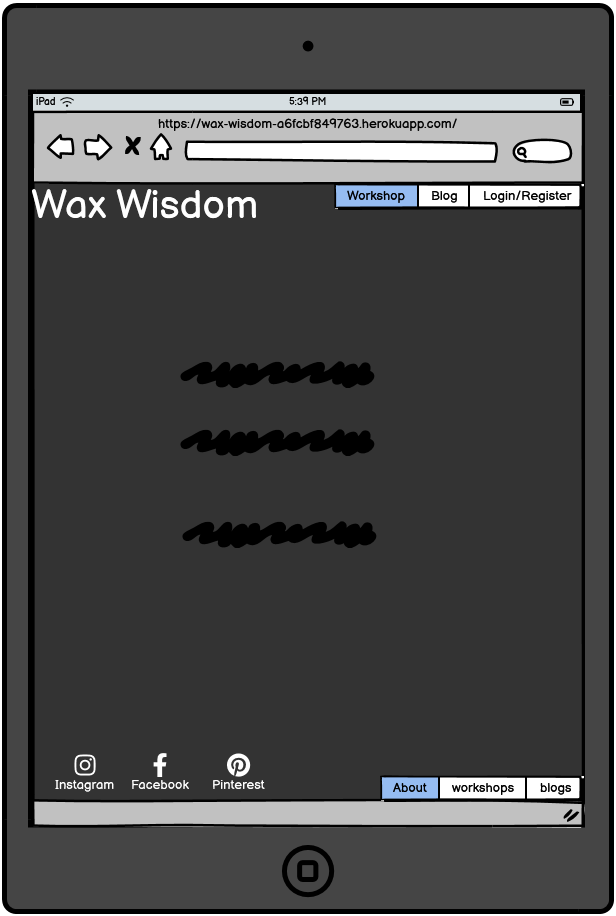

Desktop home page view

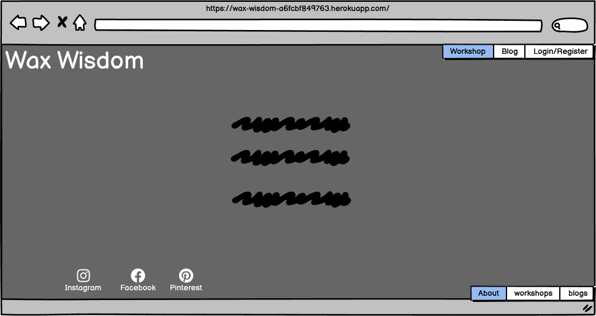

Wireframes were designed using Balsamiq, ensuring responsiveness across devices.

## Database Schema - Entity Relationship Diagram
The ERD for Wax wisdom illustrates the relationships between the users, candle enthusiasts, bookings, and more. This is essential to demonstrate the relationships between the different models in the SQLite3 database.

The ERD also demonstrates the platform's role-based structure. Each user is assigned to a specific group that determines their access level. user models can create an account and view blogs as well as book candle workshops providing their are spots left and only once they have attended the workshop can they leave a review. Admins have broader access to manage both blog creation and workshop creation data, bookings. Admin can create read update and delete (CRUD) all data.

ERD Illustration

![alt text].png>)
The above ERD was generated using lucid.app

Security
All data is securely handled with Django’s security features, including:

CSRF protection for form submissions.
Data encryption for sensitive information like passwords using Django's built-in authentication.
Role-based access control to restrict sensitive data to authorized users.

## Features

The Home page
This is the main page that customers will see and allows them to login to an existing account or create an account, From here they can also read blogs, the about page in which they can get a good gist of who we are and what we specialise in. [click here to view homepage ](https://wax-wisdom-a6fcbf849763.herokuapp.com/)

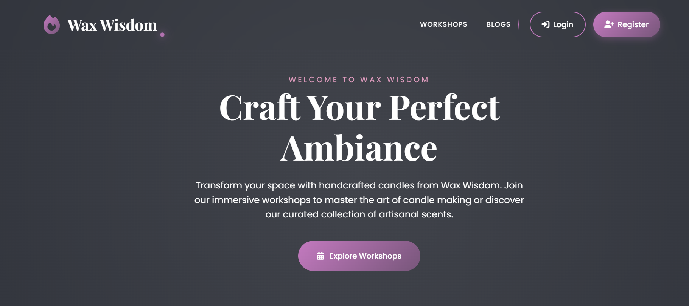

create an account page

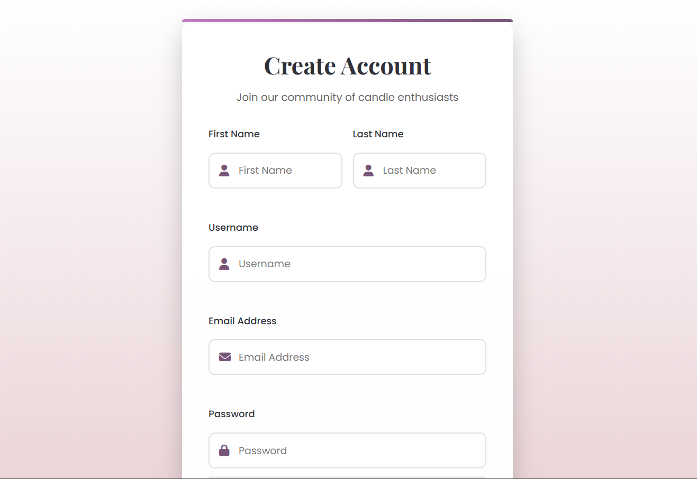

login page

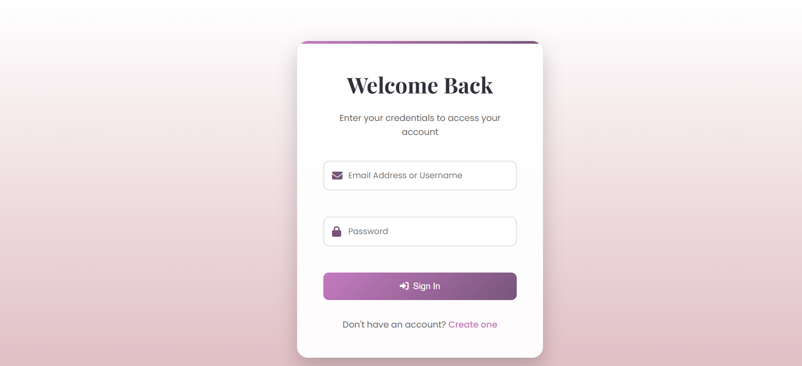

previous and upcoming candle workshop page

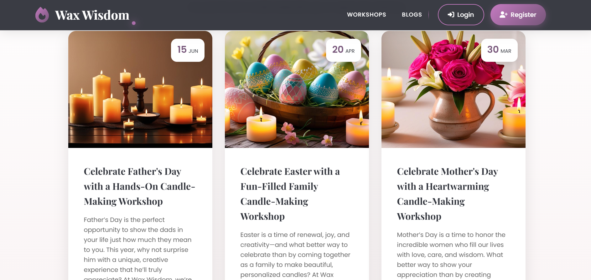

about page

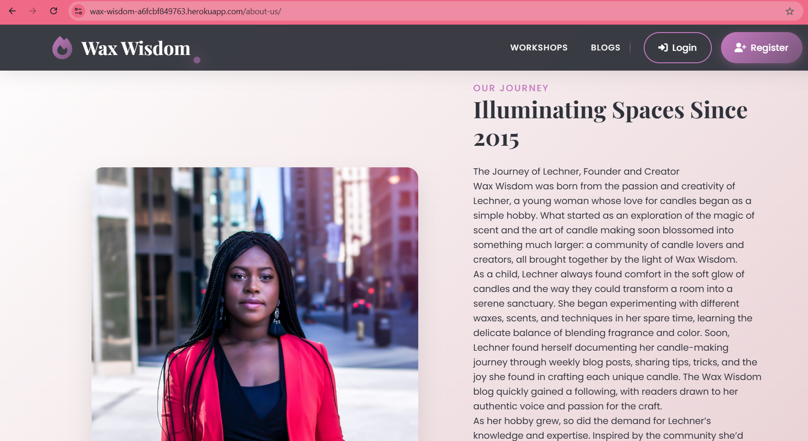

admin panel login page

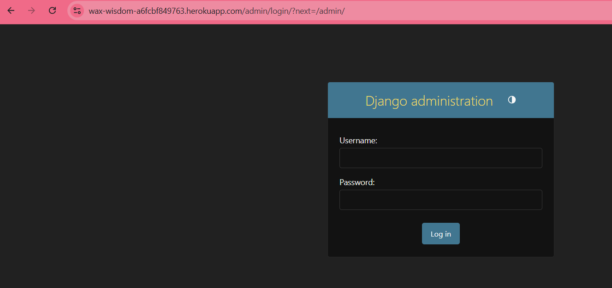

admin section

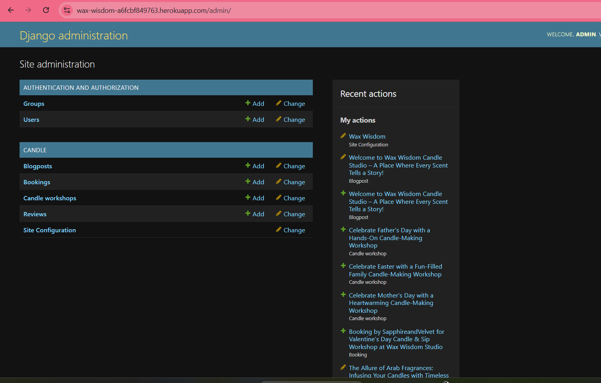

once customers are logged in they can read blogs, book workshops and leave reviews once they have attended the workshops

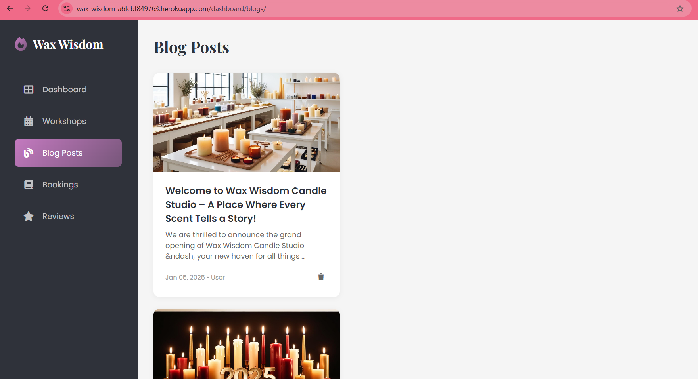

users can leave reviews once they have attended a candle workshop

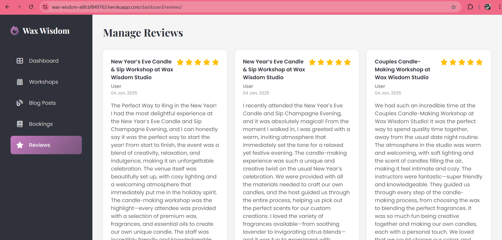

for admin login internal view

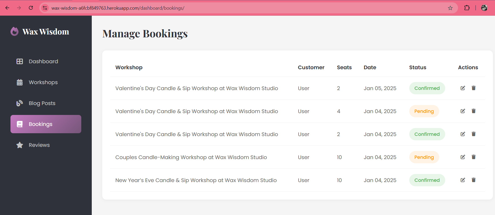

succesful account creation message


succesful login message


succesful logout message


## Technologies & Languages Used
- HTML5 - Markup language for structuring the website
- CSS3 - Styling language for designing the layout and visual aesthetics
- JavaScript - For event listner and toggle menu
- Python (Django) - Backend web framework for server-side logic and management
- SQLite3 - Database management system for storing data
- Cloudinary - Cloud-based image storage solution
- Whitenoise - For serving static files directly from Django

## Libraries & Frameworks
- **Django** - Backend framework
- **asgiref** - enables Django to handle both synchronous and asynchronous web requests 
-  **certifi** - provides a trusted set of SSL/TLS certificates that are necessary for secure, encrypted communication over HTTPS
- **charset-normalizer** - is a Python library that helps your application detect and normalize character encodings
- **cloudinary** - Media storage
- **django-cloudinary** - provides an easy, scalable, and efficient way to handle media files in Django projects 
- **django-tinymce** - For serving static files
-  **idna** - is a Python package that provides support for Internationalized Domain Names (IDN).
- **pillow** - Pillow is a powerful and easy-to-use library for image processing in Python.
-  **requests** - is a Python library used to make HTTP requests to interact with web servers and APIs.
-  **six** - is a library that helps ensure compatibility between Python 2 and Python 3
-  **sqlparse** - is a Python library that helps with parsing, formatting, and analyzing SQL queries.
-  **urllib3** -  a foundational library for making HTTP requests in Python
-  **whitenoise** - is a Python package that simplifies the process of serving static files

## Tools & Programs
- **GitHub Projects** - Project management and tracking
- **Heroku** - Deployment and hosting
- **Balsamiq** - Wireframes 

## **Testing**

### **Validation Testing**

All code has been validated through:
- **HTML**: [W3C Markup Validator](https://validator.w3.org/).
- **CSS**: [W3C CSS Validator](https://jigsaw.w3.org/css-validator/).
- **Python**: PEP8 validation to ensure code quality.

![HTML validator test]

![CSS validator test]


### **User Testing**

- **Browser Compatibility**: The website has been tested on Chrome, Firefox, Safari, and Edge.
- **Responsiveness**: The platform has been tested on mobile, tablet, and desktop devices to ensure optimal performance.
- **Automatic Assignment Testing:** Tests were conducted to verify that newly registered users are automatically assigned to the "user" group and that their userProfile was successfully created. This was confirmed through both the user interface and the Django admin panel.

- Lighthouse performance testing

  

### **Bugs**
- ### Bug Fix #1: `DISABLE_COLLECTSTATIC` Setting Causing Heroku Deployment Failure

**Issue:**  
During the deployment to Heroku, the following error occurred:

The error was caused by the absence of proper static file handling and a misconfiguration in the `INSTALLED_APPS` list in `settings.py`.

#**Cause:**  
- The `DISABLE_COLLECTSTATIC=1` config variable was used in Heroku to prevent collectstatic from running during the initial setup.
- There was a duplicate entry for `django.contrib.staticfiles` in `INSTALLED_APPS`, which caused an error when trying to collect static files.

**Steps Taken to Fix:**
1. Fixed the duplicate `django.contrib.staticfiles` entry in `INSTALLED_APPS`.
2. Ensured the static and media handling was properly set up with Cloudinary and Whitenoise.
3. Deleted the `DISABLE_COLLECTSTATIC=1` from Heroku's Config Vars.
4. Deployed again, which successfully collected static files and completed the deployment.

- ### Bug Fix #2: Database Migrations Failing

**Issue:** 
tried to run python manage.py migrate, got an error stating the database migration has failed.

**Cause:** 
- there’s a mismatch between the migrations and the database schema.
- Missing migrations that haven't been applied yet.

**Steps Taken to Fix:**
Ensured all migrations were created and applied
used makemigrations and migrate commands in terminal

- ## Bug Fix #3: Not Setting Django's DEBUG to False in Production

**Issue:** 
After deploying the app, saw detailed Django error pages with sensitive information (like database credentials or secret keys), which can be a security risk.

**Cause:** 
DEBUG is still set to True in your settings.py.

**Steps Taken to Fix:**
changed setting to DEBUG = not os.getenv("DJANGO_DEBUG", "true").lower() == "false"

- ### Bug Fix #4: 404 Error on Certain Pages (Missing URLs)

**Issue:** 
 Some of the links on my website (for example, booking page) lead to a 404 error page.

**Cause:** 
the URL path wasnt defined in urls.py file.

**Steps Taken to Fix:**
Checked urls.py and corrected URL patterns: syntax issue

- ### Bug Fix #5: Am i responsive page not loading

 **Issue:** 
 Deployed webpage not appearing in am i responsive page

 **Cause:** 
 settings.py was blocking iframes

 **Steps Taken to Fix:**
 added X_FRAME_OPTIONS = "allow all" temporarily to allow the iframe 
 commited save and pushed
 security issues due to clickjacking but for the project, this is ok.

- ### Bug Fix #6:  Django Static Files Not Served in Production

**Issue:** 
 CSS files are working in development but aren't being served correctly in production after deployment to Heroku or another platform.

 **Cause:** 
incorrect configuration for static files in production.
The static files weren’t collected or served correctly.

 **Steps Taken to Fix:**
 Checked settings.py configuration for static files: syntax error

## Deployment

All code for this project was written in Visual Studio/Github as the integrated development environment. GitHub was used for version control, and the application was deployed to Heroku from GitHub.

### Pre-Deployment

To ensure a successful deployment to Heroku, the following practices are to be followed (Experience from previous Django projects):

- **Requirements File:** The `requirements.txt` file must be kept up to date to ensure all imported Python modules are configured correctly for Heroku.
- **Procfile:** A `Procfile` was added to configure the application as a Gunicorn web app on Heroku.
- **Allowed Hosts:** In `settings.py`, the `ALLOWED_HOSTS` list was configured to include the Heroku app name and `localhost`. Example format:
    ```python
    ALLOWED_HOSTS = ['your-app-name.herokuapp.com', 'localhost']
    ```
- **Environment Variables:** All sensitive data such as the `DATABASE_URL`, `CLOUDINARY_URL`, and `SECRET_KEY` were added to the `.env` file, which is ignored by Git using `.gitignore`. These variables are added to Heroku manually through the Config Vars section.

### Deploying with Heroku

The steps for deploying to Heroku are as follows (Experience from previous Django projects):

1. **Create New App:** Log in to your Heroku account and click on the "Create New App" button.
2. **App Name:** Choose a unique name for your app.
3. **Select Region:** Choose the appropriate region (Europe was selected for this project).
4. **Create App:** Click the "Create App" button to proceed.
5. **Deployment Method:** In the "Deploy" tab, select GitHub as the deployment method.
6. **Connect to GitHub:** Search for the repository name and click "Connect".
7. **Manual or Automatic Deployment:** Select either manual or automatic deployment. Ensure the main branch is selected for deployment.
8. **Config Vars:** In the "Settings" tab, click "Reveal Config Vars" and input the required environment variables.
9. **Buildpack:** Select Node.js and Python as the buildpacks for your project.
10. **Deploy:** Once the configuration is complete, click the "Deploy Branch" button. After successful deployment, a "View" button will appear to take you to the live site.

The live link for this project can be found here: <a href="https://wax-wisdom-a6fcbf849763.herokuapp.com" target="_blank">wax-wisdom</a>

### Fork this Repository

1. Go to the GitHub repository.
2. Click the "Fork" button in the upper right-hand corner.

### Clone this Repository

1. Go to the GitHub repository.
2. Click the "Code" button at the top of the page.
3. Choose between 'HTTPS', 'SSH', or 'GitHub CLI' depending on your preference.
4. Click the copy button to copy the URL.
5. Open Git Bash.
6. Change the working directory to where you want to clone the directory.
7. Type:
    ```bash
    git clone https://github.com/originalcindy/wax-wisdom
    ```
8. Press Enter to create the local clone.

**Note:** The difference between a clone and a fork is that with a clone, you need permission to push changes to the original repository, whereas a fork creates an entirely new project under your GitHub account.

## Privacy Policy

As part of my **Wax Wisdom** project, I am dedicated to ensuring that users’ personal data is handled responsibly. The following privacy practices outline how information is collected, used, and stored within this academic project.

- **Data Collection**: Wax Wisdom, as a project, collects personal data during user registration and profile setup. This includes:
  - First and Last Name
  - Contact Information (Email)

- **Data Usage**: The information gathered is used solely for educational purposes, including:
  - Managing user profiles.
  - Facilitating workshop bookings between users (candle enthusiasts) and admin.
  
- **Data Sharing**: As this is a student project, personal data will not be shared with any third parties. It will only be used for demonstrating the functionality of the project. All information remains confidential and will not be distributed beyond the scope of the Wax Wisdom Project.

- **Security**: While this project is intended for educational use, I strive to implement best practices for data security using the Django framework’s built-in tools. Personal information is securely stored in the database and protected against unauthorised access.

- **User Rights**: Users of this platform, as part of this project, have the right to request modifications or deletion of their data. For any requests or concerns about personal data usage in this project, please contact the project owner at the provided email address.

Since this is an educational project, the privacy and data handling policies may evolve over time as more features are added and refined.

## Credits

### Code
- **Django Documentation**: The official docs were invaluable in setting up the project structure and solving specific issues.
- **Chatgpt AI**: coding ideas
- **Google Fonts**: For typography.

### Media
- images sourced from **Canva** and **unsplash**
- ERD illustration was generated from **lucid.app** 

### Additional reading/tutorials/books/blogs
- **python programming bible** by James P Meyers
- **Django visual guide** by Ben Bloomfield
- **Django for Beginners** by William S. Vincent.
- **Modern operating systems** by Andrew S Tannebaum

### Supportive Family
- My family for their support and patience during this project. 


